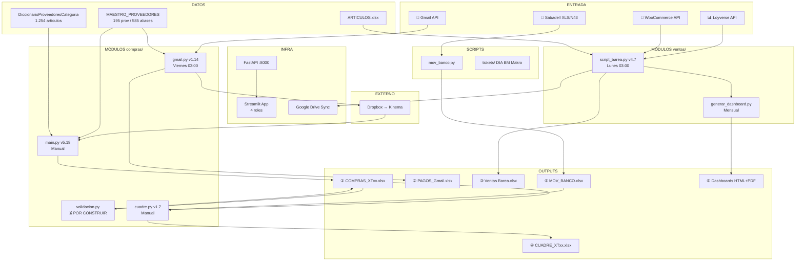
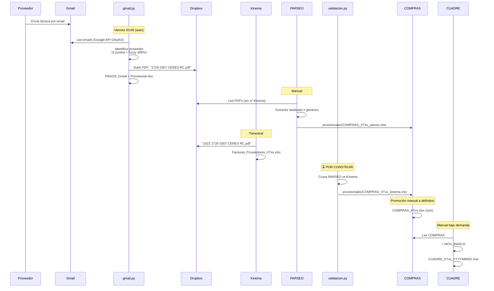
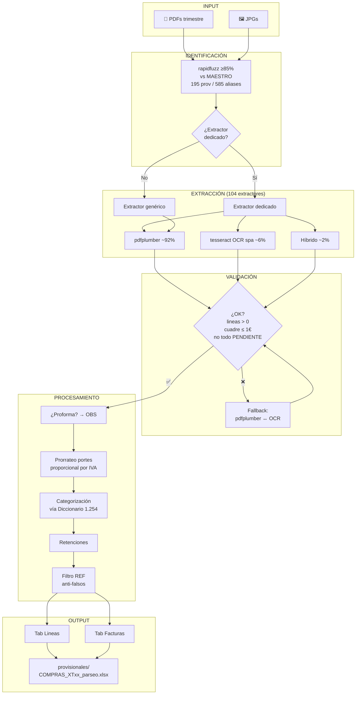
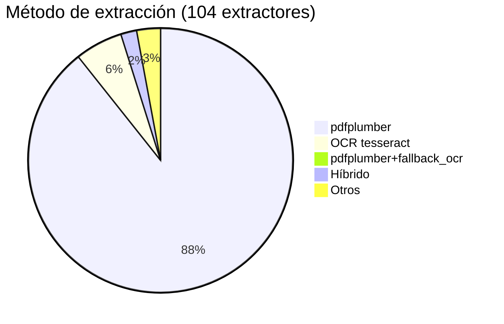
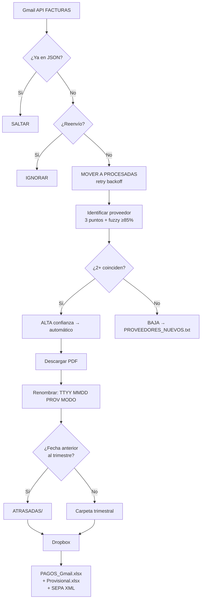
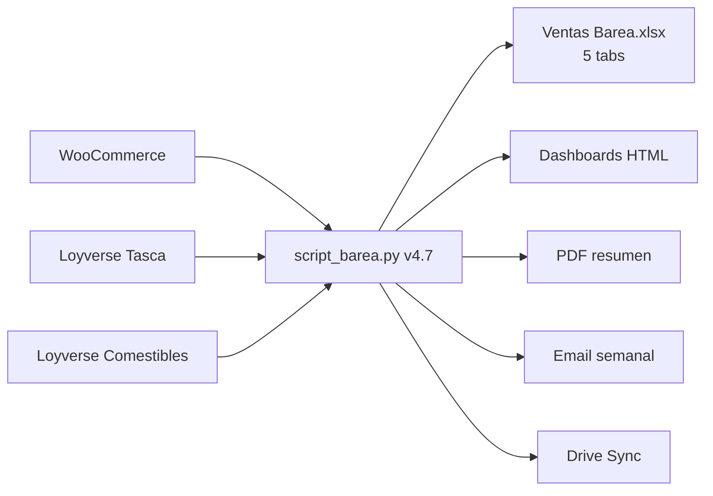
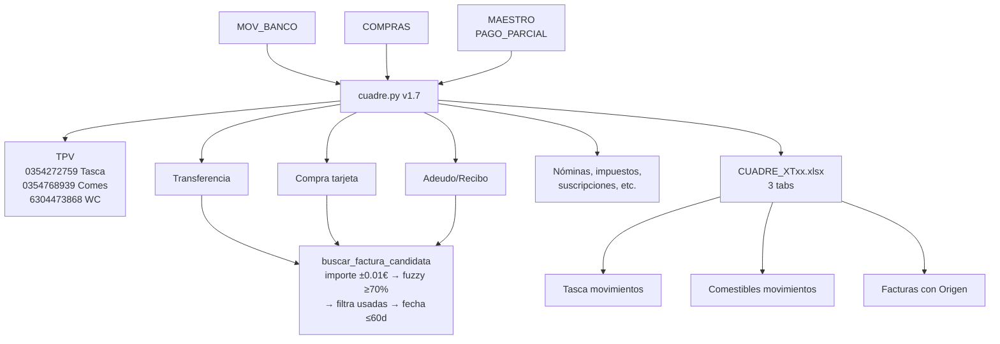
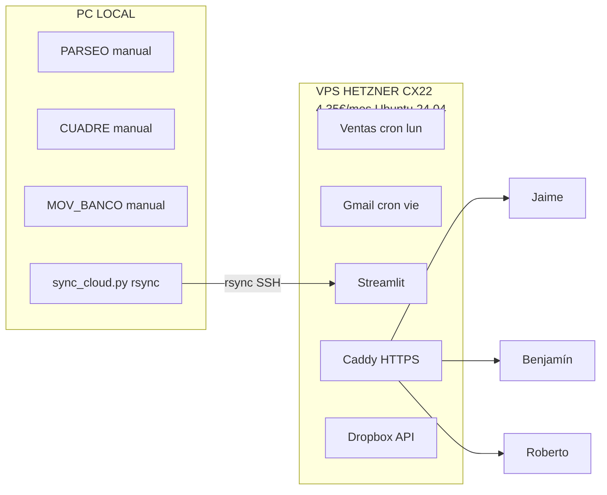
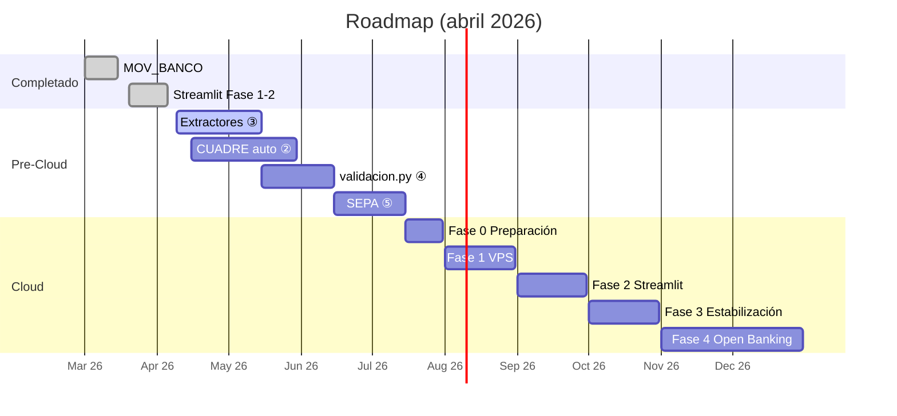

# ESQUEMA COMPLETO — GESTIÓN FACTURAS

> Basado en `SPEC_GESTION_FACTURAS_v4.1` (01/04/2026)
> Generado: 09/04/2026

---

## 1. VISIÓN GENERAL

Sistema integrado de facturación para **TASCA BAREA S.L.L.** — dos negocios en Lavapiés/Madrid:
- **Tasca Barea** (bar/tapas, Calle Rodas 2) — ~326K€/año
- **Comestibles Barea** (tienda gourmet, Calle Embajadores 38) — ~107K€/año (abierta nov 2024)
- **WooCommerce** — experiencias/talleres (~85% margen)

### 1.1 Los 4 módulos + estado

| Módulo | Archivo | Versión | Líneas | Ejecución | Estado |
|---|---|---|---|---|---|
| Ⓐ PARSEO | `compras/main.py` | v5.18 | ~6.000 | Manual | ✅ 85% |
| Ⓑ GMAIL | `compras/gmail.py` | v1.14 | ~2.200 | Auto viernes 03:00 | ✅ 99% |
| Ⓒ VENTAS | `ventas/script_barea.py` | v4.7 | 1.822 | Auto lunes 03:00 | ✅ 95% |
| Ⓓ CUADRE | `compras/cuadre.py` | v1.7 | ~1.300 | Manual | ✅ 80% |

### 1.2 Actores y sistemas externos

| Actor / Sistema | Rol |
|---|---|
| **Jaime** | Operador, desarrollador, socio (sistemas y finanzas) |
| **Kinema (gestoría)** | Valida facturas, añade nº secuencial, fiscal/nóminas |
| **Dropbox** | Almacén compartido Jaime ↔ Kinema |
| **Banco Sabadell** | 2 cuentas: Tasca (…1844495) y Comestibles (…1992404) |
| **Loyverse** | TPV físico ambos locales |
| **WooCommerce** | Canal online (experiencias/talleres) |
| **Odoo 19 Enterprise** | ERP en implantación |
| **Gmail (Google API)** | Recepción automática de facturas |
| **Google Drive** | Sync carpeta "Barea - Datos Compartidos" |

### 1.3 Los 6 archivos generados

| # | Archivo | Generado por | Frecuencia |
|---|---|---|---|
| ① | `COMPRAS_XTxx.xlsx` (Lineas + Facturas) | main.py (PARSEO) | Mensual/trimestral |
| ② | `PAGOS_Gmail_XTxx.xlsx` (15 cols + SEPA) | gmail.py | Semanal |
| ②b | `Facturas XTxx Provisional.xlsx` (6+1 cols) | gmail.py | Semanal |
| ③ | `Ventas Barea YYYY.xlsx` (5 pestañas) | script_barea.py | Semanal (lunes) |
| ④ | `CUADRE_XTxx_YYYYMMDD.xlsx` (3 pestañas) | cuadre.py | Bajo demanda |
| ⑤ | `MOV_BANCO_YYYY.xlsx` (tabs por trimestre) | mov_banco.py | Semanal |
| ⑥ | Dashboards HTML + PDFs resumen | generar_dashboard.py | Mensual |

### 1.4 Archivos de referencia (datos/)

| Archivo | Registros | Columnas clave |
|---|---|---|
| `MAESTRO_PROVEEDORES.xlsx` | ~195 proveedores, ~585 aliases | CUENTA, PROVEEDOR, CIF, IBAN, METODO_PDF, TIENE_EXTRACTOR, PAGO_PARCIAL |
| `DiccionarioProveedoresCategoria.xlsx` | ~1.254 artículos | PROVEEDOR, ARTICULO, CATEGORIA, TIPO_IVA |

---

## 2. ARQUITECTURA GENERAL



---

## 3. ESTRUCTURA DEL REPOSITORIO

```
gestion-facturas/
├── compras/                       # Todo lo que SALE (gastos proveedores)
│   ├── gmail.py                   # v1.14, ~2.200 líneas, Google API OAuth2
│   ├── auth.py, descargar.py, identificar.py, renombrar.py, guardar.py
│   ├── generar_sepa.py            # Generador XML SEPA
│   ├── config.py, config_local.py
│   ├── main.py                    # PARSEO v5.18, ~6.000 líneas, 104 extractores
│   ├── validacion.py              # ⏳ POR CONSTRUIR
│   ├── cuadre.py                  # v1.7, ~1.300 líneas
│   │   ├── banco/                 # Router, parser N43, clasificadores
│   │   └── norma43/               # Parser ficheros N43 Sabadell
│   └── gmail_auto.bat
│
├── ventas/                        # Todo lo que ENTRA (ingresos)
│   ├── script_barea.py            # v4.7, 1.822 líneas
│   ├── generar_dashboard.py
│   ├── dashboards/                # Templates HTML + generados + PDFs
│   └── barea_auto.bat
│
├── datos/                         # Datos de referencia
│   ├── MAESTRO_PROVEEDORES.xlsx
│   ├── DiccionarioProveedoresCategoria.xlsx
│   ├── DiccionarioEmisorTitulo.xlsx
│   ├── EXTRACTORES_COMPLETO.xlsx
│   └── emails_procesados.json
│
├── scripts/                       # Herramientas independientes
│   ├── tickets/ (comun.py, dia.py, bm.py, makro.py)
│   ├── mov_banco.py
│   ├── investigacion.py
│   └── backup_cifrado.py
│
├── nucleo/                        # Core compartido
│   ├── maestro.py                 # Singleton + cache
│   ├── utils.py                   # fmt_eur, fmt_num, to_float
│   ├── logging_config.py          # RotatingFileHandler 5MB×5
│   ├── parser.py
│   └── sync_drive.py
│
├── api/                           # FastAPI :8000
│   ├── server.py                  # health, status, alerts, data, scripts, maestro, cuadre, gmail
│   ├── auth.py                    # RBAC: api_key (lectura) + admin_key (mutación)
│   ├── runner.py                  # Jobs background
│   └── barea_api.bat              # Watchdog auto-restart
│
├── streamlit_app/                 # App web multi-usuario
│   ├── app.py                     # Login + st.navigation() + CSS corporativo
│   ├── pages/ (9 páginas)
│   └── utils/ (auth, data_client, wc_client)
│
├── config/                        # Configuración sensible (gitignored)
│   ├── datos_sensibles.py         # IBANs, CIFs, DNIs, emails
│   ├── proveedores.py
│   └── settings.py
│
├── tests/                         # 136 tests (pytest)
│   ├── unit/ (api_security:22, nucleo:48, maestro:46, runner:20)
│   └── integration/ (pendiente)
│
├── .claude/skills/                # 15 skills Claude Code
├── .github/workflows/tests.yml    # CI: pytest + coverage
└── docs/SPEC_GESTION_FACTURAS_v4.md  ← Documento maestro
```

**Nota:** PARSEO también existe en `C:\_ARCHIVOS\TRABAJO\Facturas\Parseo\` con 99 extractores en `extractores/`. El proyecto unificado apunta ahí.

---

## 4. CICLO DE VIDA DE UNA FACTURA



### Flujo de provisionales

```
compras/XTxx/
  COMPRAS_XTxx.xlsx              ← DEFINITIVO (la verdad)
  CUADRE_XTxx_YYYYMMDD.xlsx     ← Último cuadre
  provisionales/
    COMPRAS_XTxx_parseo.xlsx     ← Salida directa PARSEO
    COMPRAS_XTxx_kinema.xlsx     ← Post-validación Kinema
```

**Regla:** lo que está en raíz es la verdad. `provisionales/` son snapshots del proceso.

---

## 5. MÓDULO PARSEO — DETALLE COMPLETO

### 5.1 Arquitectura del motor



### 5.2 Pipeline paso a paso

1. **Leer PDF** del trimestre en Dropbox
2. **Identificar proveedor** — nombre archivo vs MAESTRO (`rapidfuzz ≥85%`)
3. **Seleccionar extractor** — dedicado si existe (104), genérico si no
4. **Extraer texto** — según `metodo_pdf`: pdfplumber (~92%), OCR (~6%), híbrido (~2%)
5. **Validar resultado** — si 0 líneas o descuadre >1€ → **fallback** (pdfplumber↔OCR)
6. **Detectar proforma** — regex `\bPROFORMA\b` → marca en OBS
7. **Prorratear portes** — proporcional, por grupo IVA: `portes_equiv = (portes_base × (1 + IVA_portes/100)) / (1 + IVA_productos/100)`
8. **Categorizar** — busca en Diccionario; si no → `PENDIENTE`
9. **Filtrar REF** — anti-falsos: excluye tel/CIF/fechas; mín 3 chars, 2 dígitos
10. **Validar cuadre** — `|total - Σ(base × (1 + iva/100))| ≤ 1€`
11. **Escribir Excel** → `provisionales/COMPRAS_XTxx_parseo.xlsx`

### 5.3 Estructura de salida

**Tab Lineas** (ej. 1T25: 919 filas):
`#, FECHA, REF, PROVEEDOR, ARTICULO, CATEGORIA, CANTIDAD, PRECIO_UD, TIPO IVA, BASE (€), CUOTA IVA, TOTAL FAC, CUADRE, ARCHIVO, EXTRACTOR`

**Tab Facturas** (ej. 1T25: 259 facturas):
`#, ARCHIVO, CUENTA, Fec.Fac., TITULO, REF, TOTAL FACTURA, Total Parseo, OBSERVACIONES`

ESTADO_PAGO y MOV# → NO se rellenan en PARSEO (es cosa de CUADRE).

### 5.4 Arquitectura de extractores

```
Parseo/extractores/
├── __init__.py          ← Carga automática + registro + obtener_extractor()
├── base.py              ← ExtractorBase (clase abstracta)
├── _plantilla.py        ← Plantilla para nuevos
├── generico.py          ← Fallback
└── [104 dedicados].py
```

**Clase `ExtractorBase`:** atributos obligatorios (`nombre`, `cif`, `iban`, `metodo_pdf`) + métodos (`extraer_lineas`, `extraer_total`, `extraer_fecha`, `extraer_referencia`, `es_proforma`).

**Decorador `@registrar`** — aliases para matching automático:
```python
@registrar('CERES', 'CERES CERVEZA', 'CERES CERVEZA SL')
class ExtractorCeres(ExtractorBase):
    nombre = 'CERES'
    cif = 'B12345678'
    metodo_pdf = 'pdfplumber'
    categoria_fija = None

    def extraer_lineas(self, texto: str) -> List[Dict]:
        ...
```

Crear nuevo: copiar `_plantilla.py` → configurar → implementar → se carga automáticamente.

### 5.5 Estadísticas extractores



| Característica | Valor |
|---|---|
| Total extractores | 104 |
| Con distribución de portes | 11 |
| Con categoría fija | ~48% |
| Extraen CANTIDAD + PRECIO_UD | 41 (46%) — **~50 pendientes** |

### 5.6 Excepciones conocidas

| Proveedor | Excepción |
|---|---|
| JIMELUZ | OCR primario |
| CASA DEL DUQUE | Híbrido OCR |
| ANGEL BORJA | Híbrido |
| LA ROSQUILLERIA | Cálculo base especial |
| BM SUPERMERCADOS | `importes_con_iva=True` → base = importe/(1+iva/100) |
| LA LLEIDIRIA | pdfplumber + fallback_ocr |
| OpenAI | USD, conversión manual |
| FISHGOURMET, GADITAUN, TIRSO, etc. | OCR primario |

### 5.7 Gaps actuales (roadmap ③)

| Gap | Nº | Extractores | Prioridad |
|---|---|---|---|
| Sin CANTIDAD/PRECIO_UD | 8 | dist_levantina, emjamesa, garua, horno_santo_cristo, jesus_figueroa_carrero, odoo, organia_oleum, pago_alto_landon | Alta |
| Sin CODIGO | 14 | Varios | Media |
| Sin CATEGORIA | 27 | Dependen del Diccionario | Media |
| Sin FECHA | 7 | alambique, aquarius, cafes_pozo, icatu, ikea, isifar, viandantes | Media |
| Sin IVA | 1 | BM (usa heurística) | Baja |
| Usan OCR | 18 | Potencial mejora con PyMuPDF | Baja |

### 5.8 Reglas invariables

1. **Portes** → SIEMPRE distribuir proporcionalmente, NUNCA línea separada
2. **JPG** → Procesar si se puede; si no, mínimos → CUADRE=MINIMOS_JPG
3. **Datos incompletos** → Nunca rechazar; rellenar mínimos
4. **ESTADO_PAGO y MOV#** → NO en PARSEO (CUADRE)
5. **Fallback** → pdfplumber → OCR si descuadre >1€ o 0 líneas
6. **Proformas** → regex, marcar en OBS
7. **Fuzzy** → ≥85% para MAESTRO
8. **REF** → anti-falsos: excluye tel/CIF/fechas; mín 3 chars, 2 dígitos

---

## 6. MÓDULO GMAIL — v1.14

### Flujo



**Outputs:** PDFs en Dropbox + `PAGOS_Gmail_XTxx.xlsx` (15 cols + SEPA) + `Facturas XTxx Provisional.xlsx` (6+1 cols) + `PROVEEDORES_NUEVOS_*.txt` + `⚠️_IBANS_SUGERIDOS_*.xlsx`

**Estructura Dropbox:**
```
Dropbox/.../CONTABILIDAD/FACTURAS 2026/FACTURAS RECIBIDAS/
├── 1 TRIMESTRE 2026/
│   ├── 1T26 0115 CERES RC.pdf
│   └── ATRASADAS/
│       └── ATRASADA 4T25 1228 JIMELUZ TR.pdf
├── 2 TRIMESTRE 2026/
└── ...
```

---

## 7. MÓDULO VENTAS — v4.7



WooCommerce: criterio devengo (fecha celebración). Dashboards: Comestibles (2 años, 13 cats, rotación, rentabilidad) + Tasca (4 años, 6 cats). Despliegue: Streamlit Cloud.

---

## 8. MÓDULO CUADRE — v1.7



**Datos 2025:** 3.945 movimientos, 1.178 facturas, 85,1% clasificados, 201 pagos parciales.

**Pendiente ②:** escribir ESTADO_PAGO de vuelta en COMPRAS.

---

## 9. MOV_BANCO — ✅

Lee XLS Sabadell → auto-detecta cuenta → formatos españoles → invierte orden → merge anual → deduplicación → renumera.

Pestañas: `1T_Tasca`, `1T_Comestibles`, etc. Columnas: #, F.Operativa, Concepto, F.Valor, Importe, Saldo, Ref1, Ref2.

---

## 10. NOMENCLATURA

### Facturas: `[ATRASADA] TTYY MMDD PROVEEDOR [N] MODO.ext`

| MODO | Significado |
|---|---|
| RC | Recibo/domiciliación |
| TF | Transferencia |
| TJ | Tarjeta |
| EF | Efectivo |

Con Kinema: `1023 1T26 0307 CERES RC.pdf`

**Regla 15 días:** primeros ~15 días del nuevo trimestre → facturas del anterior van a carpeta anterior, no a ATRASADAS.

### Estilos Excel

Tasca: TableStyleMedium9 (azul) | Comestibles: TableStyleMedium4 (verde) | Facturas: TableStyleMedium3 (rojo)

---

## 11. INFRAESTRUCTURA

### API REST (FastAPI :8000)

Endpoints: health, status, alerts, data, scripts, maestro, cuadre, gmail. RBAC 2 niveles. 136 tests. CI GitHub Actions.

### Streamlit (tascabarea.streamlit.app)

4 roles: admin (Jaime), socio (Roberto), comes (Elena), eventos (Benjamín). Diseño: Syne + DM Sans, sidebar oscuro.

| Fase | Estado |
|---|---|
| 1 — 4 secciones + Hub | ✅ |
| 2 — Parseo standalone + Dropbox | ✅ |
| 3 — Backend parseo | ⏳ |
| 4 — Facturas + Diccionario | ⏳ |
| 5 — Dashboards Ventas | ⏳ |
| 6 — Cloud | ⏳ |

### Seguridad

Path traversal, CORS, uploads 10MB, passwords scrypt, rate limiting, file locking, logging 5MB×5. Git purgado (73 binarios, 65 patrones).

---

## 12. MIGRACIÓN CLOUD



Futuro: Open Banking vía GoCardless (tier gratuito, Sabadell PSD2).

---

## 13. HOJA DE RUTA



### Pendientes sueltos

- ⚠️ Revisar PAGOS_Gmail output (pendiente desde 13/02/2026)
- ⚠️ Limpiar WooCommerce: 69 → 10 columnas
- ⚠️ Mover PARSEO a gestion-facturas (integración completa)

### Puntos abiertos

| ID | Decisión |
|---|---|
| D1 | Normalización REF — probar strip+lowercase+zeros |
| D2 | Fallback fecha ±N días — probar ±1 y ±3 |
| D3 | ¿gestion.tascabarea.es o IP directa? |
| D4 | Dashboards — ¿embeber HTML o recrear en Streamlit? |

---

## 14. DATOS DE REFERENCIA

### Cuentas bancarias

| Cuenta | IBAN | BIC |
|---|---|---|
| Tasca | ES78 0081 0259 1000 0184 4495 | BSABESBB |
| Comestibles | ES76 0081 0259 1700 0199 2404 | BSABESBB |

### Terminales TPV

| Terminal | Destino |
|---|---|
| 0354272759 | Tasca → Sabadell Tasca |
| 0354768939 | Comestibles → Sabadell Comestibles |
| 6304473868 | WooCommerce → Sabadell Comestibles |

### Automatización actual

| Tarea | Cuándo | Cómo | Migración |
|---|---|---|---|
| Ventas | Lunes 03:00 | Task Scheduler | CRON VPS |
| Gmail | Viernes 03:00 | Task Scheduler | CRON VPS |
| PARSEO | Manual | — | PC local |
| Validación | Manual trimestral | — | PC local |
| CUADRE | Manual | — | PC local |
| MOV_BANCO | Manual semanal | — | Open Banking futuro |

---

*Basado en SPEC_GESTION_FACTURAS_v4.1 (01/04/2026)*
